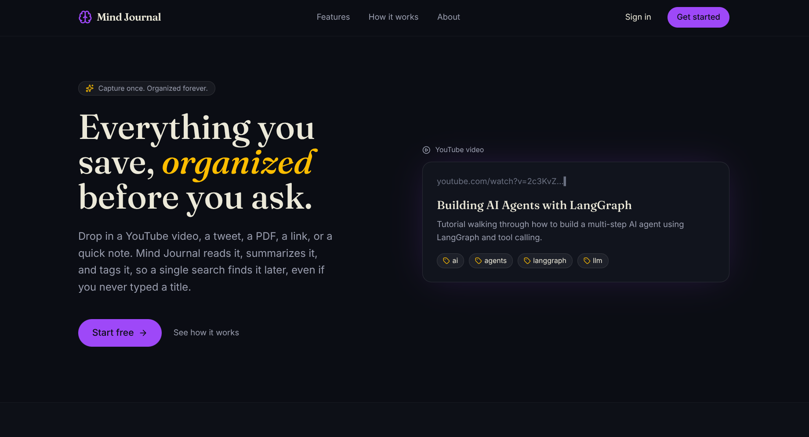

# Mind Journal

  

 

  
  
  
  
  
  
  

### AI-Powered Personal Knowledge Management Platform

Collect, organize, and rediscover your knowledge effortlessly. Mind Journal automatically analyzes videos, documents, images, tweets, links, and notes using AI to generate summaries, smart tags, and searchable metadata turning scattered information into your personal second brain.

---

## ✨ Features

-  Save YouTube videos
-  Save Twitter/X posts
-  Upload PDFs & Documents
-  Upload Images
-  Save Web Links
-  Create Notes
-  AI-generated Summaries
-  Automatic Smart Tags
-  Intelligent Search
-  Background AI Processing
-  Secure Cloud Storage
-  JWT Authentication

---

## 🛠️ Tech Stack

### Frontend
- React
- TypeScript
- React Query
- Tailwind CSS
- Axios

### Backend
- Node.js
- Express.js
- TypeScript
- Zod

### Database
- MongoDB
- Mongoose

### AI
- OpenRouter

### Background Jobs
- BullMQ
- Redis

### Cloud Storage
- Cloudinary (Signed Uploads)

### Authentication
- JWT (Access & Refresh Tokens)

### Other Tools
- Git & GitHub
- ESLint
- Prettier

---

##  Future Scope

- Semantic Search
- AI Chat with Saved Content
- Browser Extension
- Related Content Recommendations
- Vector Search
- RAG-based Document Chat

---
